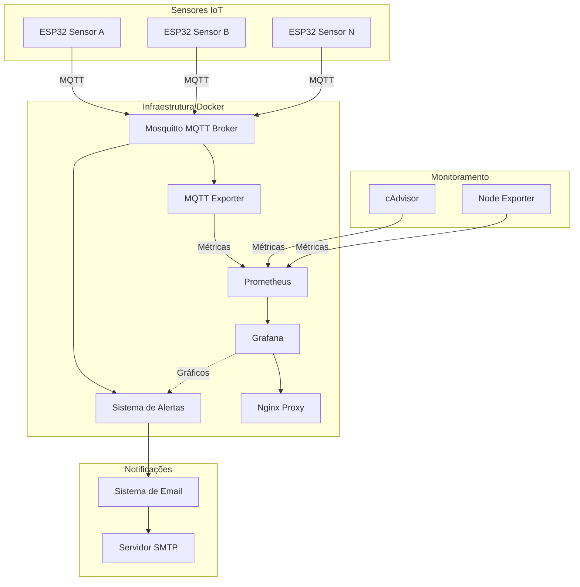
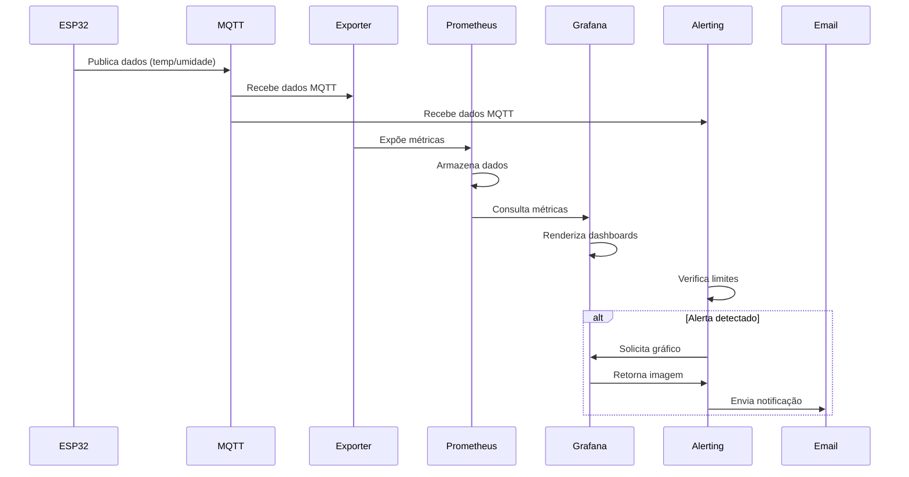
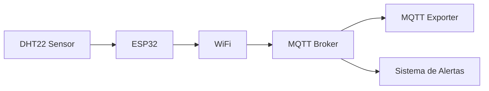
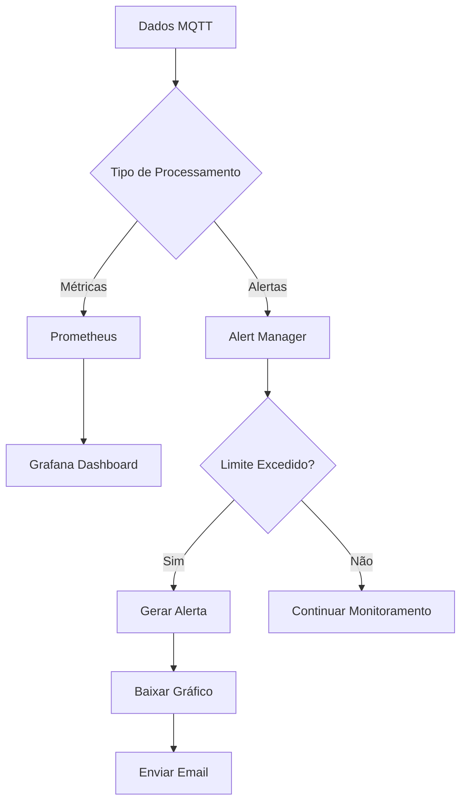
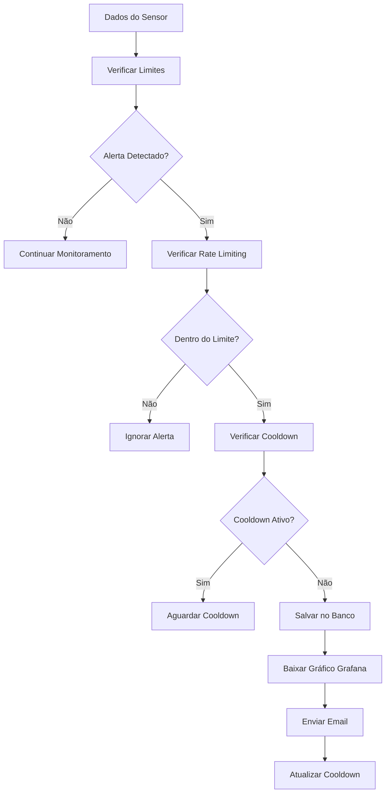

# Sistema de Monitoramento Inteligente de Clusters - IF-UFG

## 📋 Índice

- [Sistema de Monitoramento Inteligente de Clusters - IF-UFG](#sistema-de-monitoramento-inteligente-de-clusters---if-ufg)
  - [📋 Índice](#-índice)
  - [Visão Geral](#visão-geral)
    - [Características Principais](#características-principais)
  - [Arquitetura do Sistema](#arquitetura-do-sistema)
    - [Diagrama de Arquitetura Geral](#diagrama-de-arquitetura-geral)
    - [Fluxo de Comunicação](#fluxo-de-comunicação)
  - [Componentes](#componentes)
    - [1. **Sensores ESP32**](#1-sensores-esp32)
    - [2. **Mosquitto MQTT Broker**](#2-mosquitto-mqtt-broker)
    - [3. **MQTT Exporter**](#3-mqtt-exporter)
    - [4. **Prometheus**](#4-prometheus)
    - [5. **Grafana**](#5-grafana)
    - [6. **Sistema de Alertas**](#6-sistema-de-alertas)
  - [💻 Tecnologias Utilizadas](#-tecnologias-utilizadas)
    - [Backend](#backend)
    - [Monitoramento](#monitoramento)
    - [IoT](#iot)
    - [Comunicação](#comunicação)
  - [🔄 Fluxo de Dados](#-fluxo-de-dados)
    - [1. **Coleta de Dados**](#1-coleta-de-dados)
    - [2. **Processamento**](#2-processamento)
    - [3. **Limites e Alertas**](#3-limites-e-alertas)
  - [Sistema de Alertas](#sistema-de-alertas)
    - [Tipos de Alertas](#tipos-de-alertas)
    - [Fluxo de Alertas](#fluxo-de-alertas)
    - [Configuração de Email](#configuração-de-email)
  - [🚀 Instalação e Configuração](#-instalação-e-configuração)
    - [Pré-requisitos](#pré-requisitos)
    - [1. Clone do Repositório](#1-clone-do-repositório)
    - [2. Configuração dos Sensores ESP32](#2-configuração-dos-sensores-esp32)
    - [3. Configuração do Sistema](#3-configuração-do-sistema)
    - [4. Verificação da Instalação](#4-verificação-da-instalação)
    - [5. Acessos](#5-acessos)
  - [📊 Uso do Sistema](#-uso-do-sistema)
    - [Dashboard Principal](#dashboard-principal)
    - [Comandos Úteis](#comandos-úteis)
  - [Monitoramento e Dashboards](#monitoramento-e-dashboards)
    - [Métricas Disponíveis](#métricas-disponíveis)
      - [Sensores IoT](#sensores-iot)
      - [Sistema](#sistema)
      - [Alertas](#alertas)
    - [Queries Prometheus Úteis](#queries-prometheus-úteis)
  - [Troubleshooting](#troubleshooting)
    - [Problemas Comuns](#problemas-comuns)
      - [1. **Containers não iniciam**](#1-containers-não-iniciam)
      - [2. **ESP32 não conecta**](#2-esp32-não-conecta)
      - [3. **Alertas não funcionam**](#3-alertas-não-funcionam)
      - [4. **Grafana sem dados**](#4-grafana-sem-dados)
      - [5. **Performance baixa**](#5-performance-baixa)
    - [Logs Importantes](#logs-importantes)
  - [Configurações Avançadas](#configurações-avançadas)
    - [Ajustar Limites de Alertas](#ajustar-limites-de-alertas)
    - [Adicionar Novos Sensores](#adicionar-novos-sensores)
    - [Backup e Restore](#backup-e-restore)
  - [Contribuição](#contribuição)
    - [Estrutura do Projeto](#estrutura-do-projeto)
    - [Como Contribuir](#como-contribuir)
    - [Padrões de Código](#padrões-de-código)
  - [📋 TODO / Roadmap](#-todo--roadmap)
    - [Próximas Funcionalidades](#próximas-funcionalidades)
    - [Melhorias Planejadas](#melhorias-planejadas)
  - [Licença](#licença)
  - [Autores](#autores)
  - [🙏 Agradecimentos](#-agradecimentos)
  - [📞 Suporte](#-suporte)

---

## Visão Geral

O **Sistema de Monitoramento Inteligente de Clusters** é uma solução completa para monitoramento em tempo real de ambientes computacionais utilizando sensores IoT (ESP32), com alertas automáticos por email e visualização avançada de dados.

### Características Principais

- 🌡️ **Monitoramento em Tempo Real**: Temperatura e umidade via sensores ESP32
- 📧 **Alertas Inteligentes**: Sistema de notificações por email com gráficos
- 📊 **Dashboards Interativos**: Visualização de dados em tempo real via Grafana
- 🔄 **Alta Disponibilidade**: Sistema resiliente com recuperação automática
- 🐳 **Containerizado**: Deploy simples com Docker Compose
- 📱 **Interface Web**: Acesso via navegador para monitoramento

---

## Arquitetura do Sistema

### Diagrama de Arquitetura Geral



### Fluxo de Comunicação



---

## Componentes

### 1. **Sensores ESP32**

**Localização**: `esp32-sensors/`

Microcontroladores responsáveis pela coleta de dados ambientais:

- **Sensores**: DHT22 (temperatura e umidade)
- **Conectividade**: WiFi + MQTT
- **Frequência**: Dados enviados a cada 10 segundos
- **Protocolo**: JSON via MQTT

**Exemplo de dados enviados**:
```json
{
  "esp_id": "esp32_a",
  "temperature": 31.4,
  "humidity": 43.3,
  "timestamp": "2025-06-29T13:32:53Z",
  "uptime": 10688211,
  "temperature_variation": 0,
  "alert": "high_temperature"
}
```

### 2. **Mosquitto MQTT Broker**

**Configuração**: `backend/mosquitto/`

Broker MQTT responsável pela comunicação entre sensores e sistema:

- **Porta**: 1883 (MQTT) / 9001 (WebSocket)
- **Tópicos**: `legion32/{sensor_id}`
- **Persistência**: Dados salvos localmente
- **Logs**: Habilitados para debug

### 3. **MQTT Exporter**

**Código**: `backend/exporter/mqtt_exporter.py`

Converte dados MQTT em métricas Prometheus:

- **Função**: Bridge MQTT → Prometheus
- **Métricas expostas**: 
  - `temperature_celsius`
  - `humidity_percent`
  - `sensor_uptime_seconds`
- **Porta**: 8000

### 4. **Prometheus**

**Configuração**: `backend/prometheus/`

Sistema de coleta e armazenamento de métricas:

- **Porta**: 9090
- **Retenção**: 15 dias
- **Scrape interval**: 15s
- **Targets**: MQTT Exporter, cAdvisor, Node Exporter

### 5. **Grafana**

**Configuração**: `backend/grafana/`

Interface de visualização e dashboards:

- **Porta**: 3000
- **Usuário**: ``
- **Dashboards**: Temperatura, umidade, sistema
- **API**: Habilitada para geração de gráficos

### 6. **Sistema de Alertas**

**Código**: `backend/alerting/`

Sistema inteligente de detecção e notificação:

- **Limites configuráveis**: Temperatura e umidade
- **Cooldown**: 5 minutos entre alertas
- **Rate limiting**: Proteção contra spam
- **Notificações**: Email com gráficos anexados

---

## 💻 Tecnologias Utilizadas

### Backend
- **Python 3.11**: Linguagem principal
- **Docker & Docker Compose**: Containerização
- **MQTT**: Protocolo de comunicação IoT
- **SQLite**: Banco de dados para alertas

### Monitoramento
- **Prometheus**: Coleta e armazenamento de métricas
- **Grafana**: Visualização e dashboards
- **cAdvisor**: Monitoramento de containers
- **Node Exporter**: Métricas do sistema

### IoT
- **ESP32**: Microcontrolador
- **DHT22**: Sensor de temperatura e umidade

### Comunicação
- **SMTP**: Envio de emails (Zoho)
- **JSON**: Formato de dados
- **HTTP/REST**: APIs

---

## 🔄 Fluxo de Dados

### 1. **Coleta de Dados**



### 2. **Processamento**



### 3. **Limites e Alertas**

| Parâmetro | Limite Baixo | Limite Alto | Limite Crítico |
|-----------|--------------|-------------|----------------|
| **Temperatura** | 15°C | 27°C | 35°C |
| **Umidade** | 30% | 70% | - |
| **Variação Temp** | - | 5°C/5min | - |

---

## Sistema de Alertas

### Tipos de Alertas

1. **Temperatura Alta** (≥ 27°C)
2. **Temperatura Crítica** (≥ 35°C)
3. **Temperatura Baixa** (≤ 15°C)
4. **Umidade Alta** (≥ 70%)
5. **Umidade Baixa** (≤ 30%)
6. **Variação Brusca** (±5°C em 5min)
7. **Sensor Offline** (sem dados por 5min)

### Fluxo de Alertas




### Configuração de Email

```python
EMAIL_CONFIG = {
    'smtp_server': '',
    'smtp_port': 465,
    'use_ssl': True,
    'username': '',
    'to_emails': [''],
    'subject_prefix': '[ALERTA CLUSTER]'
}
```

---

## 🚀 Instalação e Configuração

### Pré-requisitos

- **Docker** 20.10+
- **Docker Compose** 2.0+
- **Git**
- **ESP32** com sensores DHT22

### 1. Clone do Repositório

```bash
git clone <repository-url>
cd cluster-monitoring
```

### 2. Configuração dos Sensores ESP32

1. Abra `esp32-sensors/src/main.cpp`
2. Configure WiFi e MQTT:

```cpp
const char* ssid = "SUA_REDE_WIFI";
const char* password = "SUA_SENHA_WIFI";
const char* mqtt_server = "IP_DO_SERVIDOR";
```

3. Compile e envie para os ESP32

### 3. Configuração do Sistema

1. **Ajustar permissões**:
```bash
chmod +x *.sh
./fix_permissions.sh
```

2. **Iniciar sistema**:
```bash
./start.sh
```

### 4. Verificação da Instalação

```bash
# Verificar containers
docker compose ps

# Verificar logs
./logs.sh
```

### 5. Acessos

- **Grafana**: http://localhost:3000
  - Usuário: ``
  - Senha: ``
- **Prometheus**: http://localhost:9090
- **MQTT Exporter**: http://localhost:8000/metrics

---

## 📊 Uso do Sistema

### Dashboard Principal

O dashboard principal mostra:

1. **Métricas em Tempo Real**
   - Temperatura atual de todos os sensores
   - Umidade atual de todos os sensores
   - Status de conectividade

2. **Gráficos Históricos**
   - Tendências de temperatura (24h)
   - Tendências de umidade (24h)
   - Uptime dos sensores

3. **Alertas e Status**
   - Últimos alertas gerados
   - Status do sistema
   - Estatísticas de performance

### Comandos Úteis

```bash
# Iniciar sistema
./start.sh

# Parar sistema
./stop.sh

# Ver logs em tempo real
./logs.sh

# Testar alertas
docker compose exec alerting python test_alert_hard.py

# Verificar dados MQTT
docker compose logs mqtt-exporter --tail=50
```

---

## Monitoramento e Dashboards

### Métricas Disponíveis

#### Sensores IoT
- `temperature_celsius{sensor="esp32_a"}`: Temperatura em Celsius
- `humidity_percent{sensor="esp32_a"}`: Umidade relativa
- `sensor_uptime_seconds{sensor="esp32_a"}`: Tempo de funcionamento

#### Sistema
- `container_cpu_usage_seconds_total`: Uso de CPU dos containers
- `container_memory_usage_bytes`: Uso de memória
- `up`: Status dos serviços

#### Alertas
- `alerts_generated_total`: Total de alertas gerados
- `emails_sent_total`: Total de emails enviados
- `sensor_offline_total`: Sensores offline

### Queries Prometheus Úteis

```promql
# Temperatura média por sensor (última hora)
avg_over_time(temperature_celsius[1h])

# Pico de temperatura (último dia)
max_over_time(temperature_celsius[24h])

# Sensores ativos
up{job="mqtt-exporter"}

# Taxa de alertas por hora
rate(alerts_generated_total[1h]) * 3600
```

---

## Troubleshooting

### Problemas Comuns

#### 1. **Containers não iniciam**

```bash
# Verificar logs
docker compose logs

# Verificar permissões
./fix_permissions.sh

# Reconstruir containers
docker compose build --no-cache
```

#### 2. **ESP32 não conecta**

- Verificar configurações WiFi
- Verificar IP do servidor MQTT
- Verificar logs do Mosquitto:
```bash
docker compose logs mosquitto
```

#### 3. **Alertas não funcionam**

```bash
# Verificar logs do sistema de alertas
docker compose logs alerting

# Testar SMTP
docker compose exec alerting python test_email.py

# Verificar cooldown
docker compose exec alerting sqlite3 /app/data/alerts.db "SELECT * FROM alerts ORDER BY timestamp DESC LIMIT 10;"
```

#### 4. **Grafana sem dados**

- Verificar Prometheus targets: http://localhost:9090/targets
- Verificar MQTT Exporter: http://localhost:8000/metrics
- Verificar datasource no Grafana

#### 5. **Performance baixa**

```bash
# Verificar uso de recursos
docker stats

# Limpar dados antigos
docker compose exec prometheus rm -rf /prometheus/data/*
docker compose restart prometheus
```

### Logs Importantes

```bash
# Sistema completo
./logs.sh

# Alertas específicos
docker compose logs alerting | grep ERROR

# MQTT
docker compose logs mosquitto | grep -i error

# Métricas
docker compose logs mqtt-exporter --tail=100
```

---

## Configurações Avançadas

### Ajustar Limites de Alertas

Edite `backend/alerting/config.py`:

```python
ALERT_CONFIG = {
    'temperature': {
        'critical_high': 35.0,  # Crítico alto
        'high': 27.0,           # Alto
        'low': 15.0,            # Baixo
        'critical_low': 5.0     # Crítico baixo
    },
    'humidity': {
        'high': 70.0,           # Umidade alta
        'low': 30.0             # Umidade baixa
    }
}
```

### Adicionar Novos Sensores

1. Configure novo ESP32 com ID único
2. O sistema detecta automaticamente novos sensores
3. Dashboards são atualizados automaticamente

### Backup e Restore

```bash
# Backup completo
tar -czf backup-$(date +%Y%m%d).tar.gz \
  backend/grafana/data/ \
  backend/prometheus/data/ \
  backend/mosquitto/data/ \
  backend/alerting/data/

# Restore
tar -xzf backup-YYYYMMDD.tar.gz
```

---

## Contribuição

### Estrutura do Projeto

```
cluster-monitoring/
├── backend/
│   ├── alerting/          # Sistema de alertas
│   ├── exporter/          # MQTT to Prometheus
│   ├── grafana/           # Configurações Grafana
│   ├── mosquitto/         # Broker MQTT
│   ├── nginx/             # Proxy reverso
│   └── prometheus/        # Configurações Prometheus
├── esp32-sensors/         # Código dos sensores
├── docs/                  # Documentação
└── scripts/               # Scripts utilitários
```

### Como Contribuir

1. **Fork** o repositório
2. **Crie** uma branch para sua feature
3. **Implemente** as mudanças
4. **Teste** completamente
5. **Envie** um Pull Request

### Padrões de Código

- **Python**: PEP 8
- **JavaScript**: ESLint
- **C++**: Arduino Style Guide
- **Docker**: Best practices

---

## 📋 TODO / Roadmap

### Próximas Funcionalidades

- [ ] **Mobile App**: Aplicativo para monitoramento móvel
- [ ] **Machine Learning**: Predição de falhas
- [ ] **Clustering**: Suporte a múltiplos clusters
- [ ] **API REST**: API completa para integração
- [ ] **Webhooks**: Notificações via Slack/Discord
- [ ] **Backup Automático**: Backup programado na nuvem
- [ ] **SSL/TLS**: Segurança completa
- [ ] **Multi-tenant**: Suporte a múltiplos usuários

### Melhorias Planejadas

- [ ] **Performance**: Otimização de consultas
- [ ] **UI/UX**: Interface mais intuitiva
- [ ] **Documentação**: Vídeos tutoriais
- [ ] **Testes**: Cobertura de testes automatizados
- [ ] **CI/CD**: Pipeline de deploy automático

---

## Licença

Este projeto está licenciado sob a **MIT License** - veja o arquivo [LICENSE](LICENSE) para detalhes.

---

## Autores

- **Matteus Victor** - *Desenvolvedor Principal* - [victor.matt2003@gmail.com](mailto:victor.matt2003@gmail.com)
- **IF-UFG** - *Instituição* - Instituto Federal de Goiás

---

## 🙏 Agradecimentos

- **IF-UFG** pela infraestrutura e suporte
- **Comunidade Open Source** pelas ferramentas utilizadas
- **Docker Community** pela containerização
- **Grafana Labs** pela plataforma de visualização
- **Prometheus Community** pelo sistema de métricas

---

## 📞 Suporte

Para suporte técnico ou dúvidas:

- **Email**: victor.matt2003@gmail.com
- **Issues**: Use o sistema de issues do GitHub
- **Documentação**: Consulte esta documentação completa

---